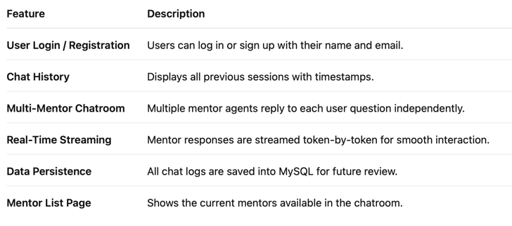
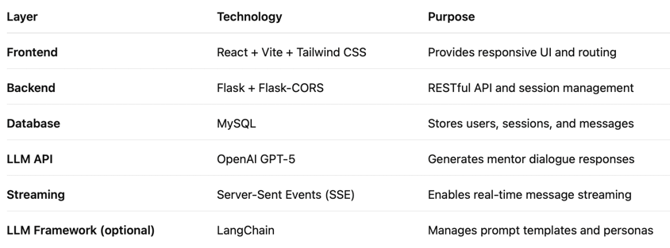
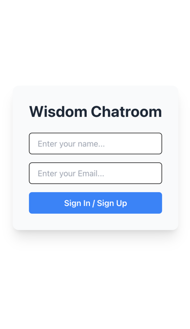
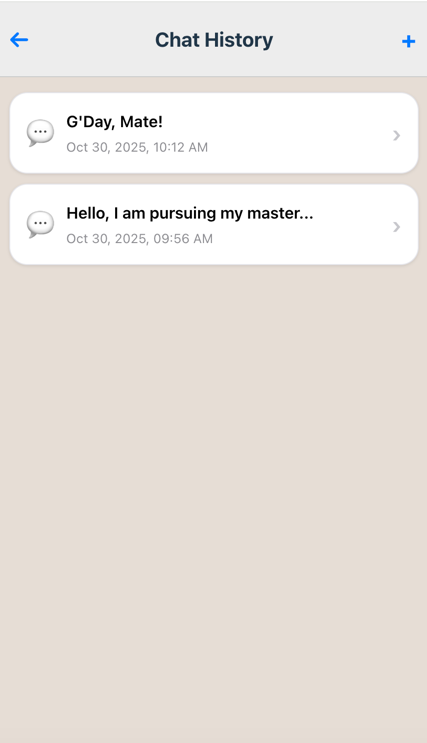
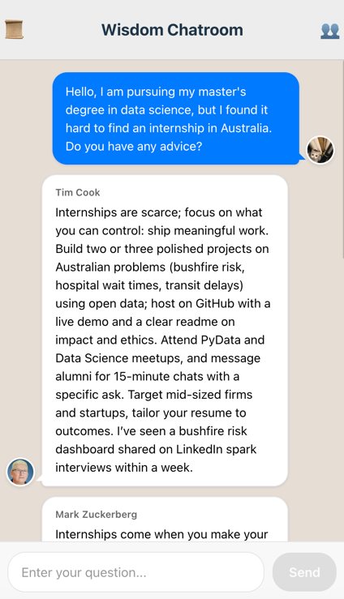
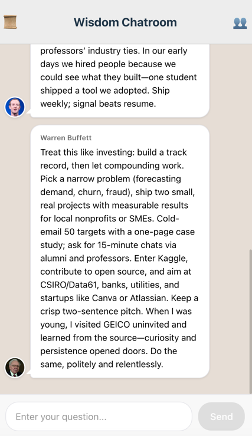
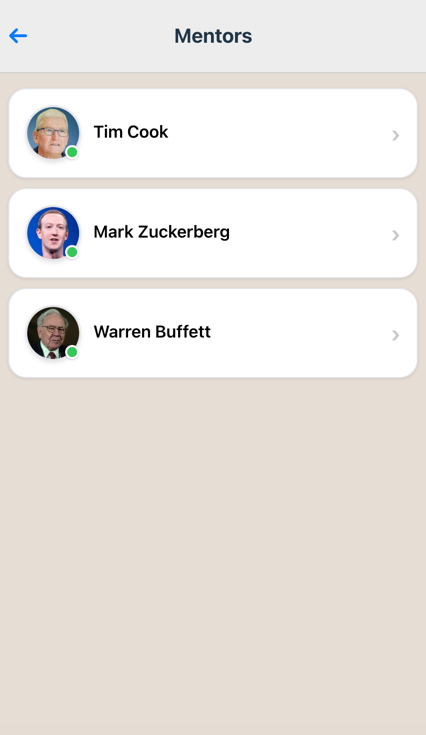
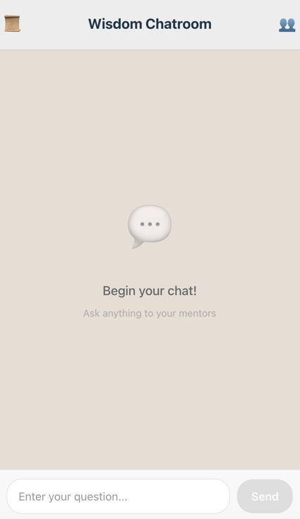

# Wisdom Chatroom

## 1. How to Run

This project includes both a Flask backend and a React frontend.
Please ensure that Python 3.10+ and Node.js (with npm) are installed before running.

### Backend Setup
Install dependencies

`pip install -r requirements.txt`

### Configure MySQL database
Update the connection parameters in the get_conn() function with your credentials.
Create the required tables:
```SQL
CREATE TABLE chatroom_users (
    id INT AUTO_INCREMENT PRIMARY KEY,
    name VARCHAR(50) NOT NULL,
    email VARCHAR(100) NOT NULL,
    created_at DATETIME DEFAULT CURRENT_TIMESTAMP,
    CONSTRAINT unique_email UNIQUE (email)
);

CREATE TABLE chatroom_sessions (
    id INT AUTO_INCREMENT PRIMARY KEY,
    session_id CHAR(36) NOT NULL,
    user_id INT NOT NULL,
    session_name VARCHAR(100),
    created_at DATETIME DEFAULT CURRENT_TIMESTAMP
);

CREATE TABLE chatroom_chat_messages (
    id INT AUTO_INCREMENT PRIMARY KEY,
    session_id CHAR(36) NOT NULL,
    sender VARCHAR(100) NOT NULL,
    content TEXT NOT NULL,
    timestamp DATETIME DEFAULT CURRENT_TIMESTAMP
);
```


### Run the backend
```bash
python run.py
```
The backend server will be available at:
```angular2html
http://127.0.0.1:5050
```

## 2. Project Overview

Wisdom Chatroom is a multi-mentor conversational platform powered by large language models (LLMs).
It simulates a virtual chatroom where multiple mentors — such as Tim Cook, Mark Zuckerberg, and Warren Buffett — provide personalized, experience-based advice to the user.

Unlike conventional single-chat systems, this chatroom allows mentors to respond concurrently and share diverse perspectives, creating a more realistic and dynamic dialogue experience.

## 3. Main Features

<p align="center">
  
</p>

---

## 4. Technology Stack

<p align="center">
  
</p>

---

## 📸 Screenshots

<p align="center">
  
  
  
</p>

<p align="center">
  
  
  
</p>